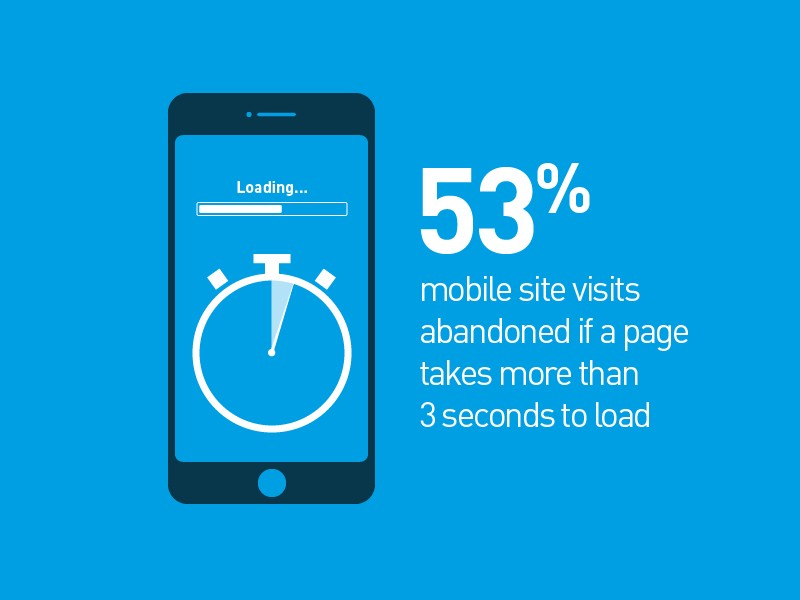
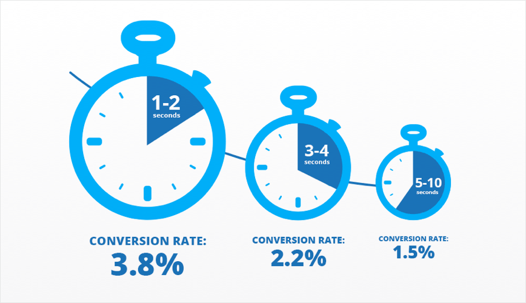
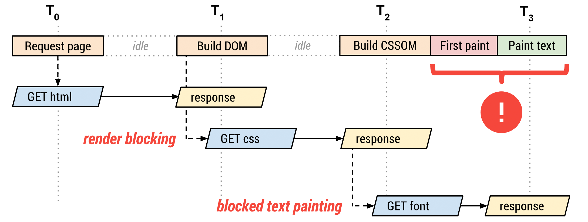
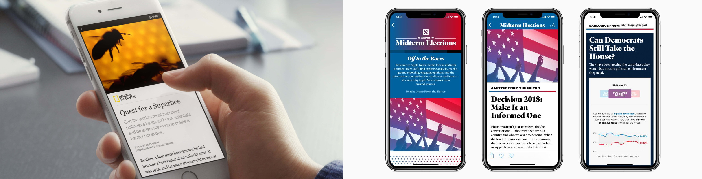
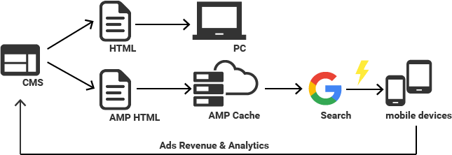
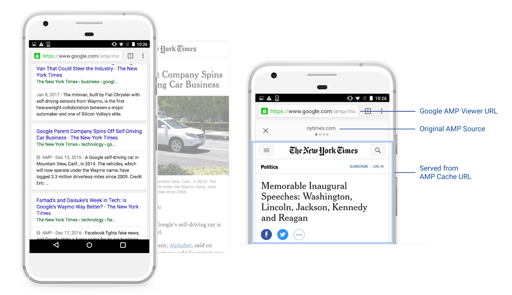
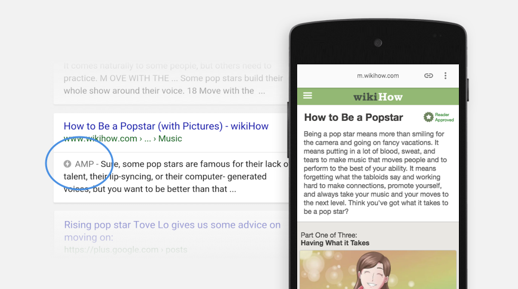
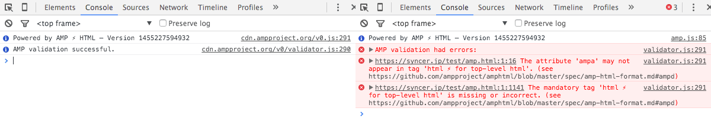
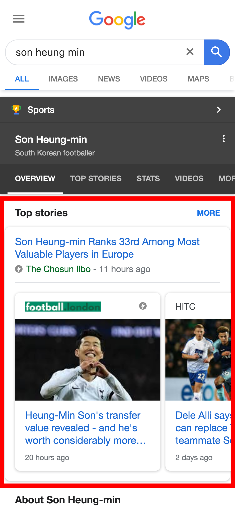
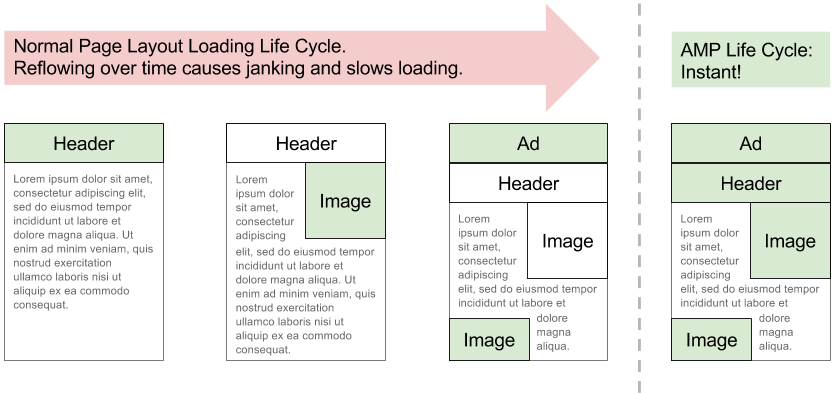

AMP | Accelerated Mobile Pages 자료 정리

# AMP
- AMP 배경
- AMP 소개
- AMP 문서 살펴보기

# AMP 배경

## 배경


Google은 검색 결과에서 링크를 클릭하는 사용자 분석 결과에 따르면
- 로드 시간이 3초이상 걸리면 모바일 사이트 방문 포기 → 약 53%
- 로드 시간이 1초 ~ 10초 길어지면 이탈률 → 123% 증가

## 속도의 영향
- 웹에서 속도는 중요
- 페이지 로드 시간이 수익에 직접적인 영향을 미칠 수 있음


전자상거래 사이트가 하루에 10만 달러를 벌고 있다면, 1초 지연으로 인해 매년 250만 달러의 매출 손실이 발생할 가능성이 있다. [(참고)](https://neilpatel.com/blog/loading-time/)
* 전환율 (conversion rate): 웹 사이트 방문자가 제품 구매, 회원 가입,등 웹 사이트가 의도하는 행동을 취하는 비율.
이탈률은 매출과 연결된다. 고객 이탈률이 줄어들면 구매전환율이 올라간다. 
고객 이탈률이 높아지면 구매전환율은 낮아진다. 


## 웹 페이지가 느린 이유
동기 방식으로 외부 JavaScript, CSS를 로딩하는 일반적인 웹 페이지에서 
웹 폰트를 다운로드할 때 브라우저는 다음 그림과 같이 많은 과정이 끝나길 기다려야 한다.

AMP는 웹 폰트를 다운로드하기 전까지 어떠한 HTTP 요청도 하지 않는다.
AMP가 모든 JavaScript를 비동기 방식으로 로딩하며 오직 내부 CSS만 사용할 수 있기 때문에 가능



- 웹 페이지 용량 - 용량이 큰 이미지, 너무 많은 텐츠
- HTTP 요청 수 - CSS와 이미지를 적절히 요약, 외부 리소스 더 적게 포함
- 느린 스크립트 실행 - 라이브러리, 플러그인, 써드 파티 스크립트
- 웹폰트 - 용량이 매우 큼, 다운로드가 완료될 때까지 텍스트 렌더링 지연
- 광고 - 지나치게 많은 광고


## 비즈니스 사례

경쟁사 위협에 대한 대응, 광고 수익을 유지할 필요성에서 비롯

- 페이스북 Instant Articles, Apple News
- 소셜을 통한 뉴스 소비가 늘어나면, 검색을 통한 뉴스 소비는 감소
- 앱 환경에서 뉴스 형태의 콘텐츠에 초점을 맞춘 방식 (폐쇄적)
- 구글 광고 수익에 대한 위협 (광고에 대한 안 좋은 인식)
- 사용자들의 광고 차단, 광고를 보지 않고 느린 사이트를 떠난다면 광고 수익 하락

페이스북과 애플은 AMP가 발표되기 전 비슷한 기술을 먼저 출시
인스턴트 아티클을 통해 뉴스 소비 경험이 좋아진다면 페이스북에서의 뉴스 소비가 증가
콘텐츠 소비 시간 극적으로 늘어나지 않는 이상, 한쪽의 증가는 다른 한쪽의 감소를 가져오기 마련
소셜을 통한 뉴스 소비가 늘어나면, 검색을 통한 뉴스 소비는 줄어든다.
서비스 사업자에게 사용자 경험의 개선은 생존 문제와 연결

# AMP 소개

## AMP
- Accelerated Mobile Pages
- 웹 페이지를 즉시 로드, 컨텐츠를 빠르게 표시하는 것이 목적
- 2015년 10월 Google에서 시작한 오픈소스 프로젝트
- 2016년 2월 부터 Google 모바일 검색 결과에 적용
- 초기 AMP는 뉴스 형태의 콘텐츠에 중점 → 전자상거래, 이메일용 AMP 계속 확장

## 주요 구성 요소
- AMP HTML 웹 컴포넌트
- AMP JS 리소스 관리
- AMP Cache 캐싱 (CDN)

## AMP HTML
- HTML5 기반으로 AMP 콘텐츠를 작성
- 빠른 성능을 위해 사용할 수 있는 HTML 태그 제한
- 대신 AMP 컴포넌트 (사용자 정의 태그) 제공
- 초기 학습 비용이 부과
- AMP HTML 유효성 검사 반드시 통과
- 유효성 검증이 안 될 경우 Google은 AMP 페이지를 인식하지 못함

## AMP JS
- 사용자 정의 자바스크립트가 허용되지 않음
- AMP JS 기본 라이브러리 제공
- 모든 JS는 비동기 방식으로 실행
- 동작과 관련된 다양한 UI기능은 AMP 확장 컴포넌트를 통해 개발
- amp-iframe 내부에서는 별도 외부 CSS, JS 포함 가능
- 빠른 렌더링 보장을 위해 엄격한 웹 성능 모범 사례를 바탕으로 구현

## AMP Cache


- AMP 기술을 적용한 페이지는 무료 Google CDN 서버에 캐싱하는 방식으로 운영
- AMP 페이지도 빠르지만 AMP Cache로 즉시 로드 가능
- Google 검색 결과에서 링크 클릭시 실제 사이트로 연결시켜주는 것이 아니라 미리 캐싱한 데이터를 보여줌으로써 로드 시간 개선

## AMP 성능 개선 방법
- 모든 리소스 크기를 정적으로 지정
- 리소스가 다운로드 될때까지 기다리지 않고 레이아웃 위치 ​​계산
- 인라인 CSS만 허용, 크기 50KB 제한
- 비동기 스크립트만 허용 Non-blocking
- 외부 리소스를 기다리지 않고 바로 렌더링 시작
- GPU 가속 애니메이션만 실행
- 화면에 보이는 부분, 사용자가 볼 가능성이 있는 영역 리소스를 먼저 로드
- 백그라운드에서 웹 페이지 사전 렌더링


## AMP 사전 렌더링
Google 검색 결과에서 AMP로 구현된 모든 페이지는 AMP Viewer를 통해 표시
- 방문 전, 백그라운드에서 AMP 페이지를 다운로드하고 AMP 캐시에 저장
- 사전 렌더링된 AMP 링크 클릭 시, AMP Viewer에 즉시 표시



## AMP 논란
- AMP Cache는 Google이 소유하고 운영, Google URL 사용으로 브랜드가 희석
- 사이트 입장에서는 사용자 정보도 알 수 없고 트래픽도 발생되지 않음
- Google은 검색 결과에서 AMP 페이지를 특별하게 취급
- 중앙 집중식 JavaScript
- 라이브러리를 사용할 수 없거나 손상된 경우 모든 AMP 사이트에 문제 발생
- W3C 표준은 아니라는 점, 새로운 웹표준?!
- 실제 AMP 페이지를 Google을 통하지 않고 접속해 보면 다른 웹페이지와 차이가 크게 없음
- AMP보다 구글이 검색을 가지고 있기에 가능한 부분
- 브라우저 지원 범위

## AMP == SEO

- Google 검색 결과 우대
- Google 검색결과 페이지에 AMP 번개 아이콘(⚡)으로 식별
- AMP 페이지는 검색 상단 Top Stories 영역에 노출
- Google은 모바일 검색결과 우선 순위 조건에서 페이지 속도를 순위에 반영


# AMP 문서 살펴보기
## 필수 마크업
```html
<!doctype html>
<html ⚡ lang="ko">
<head>
    <meta charset="utf-8">
    <title>Sample document</title>
    <link rel="canonical" href="./regular-html-version.html">
    <meta name="viewport" content="width=device-width,minimum-scale=1,initial-scale=1">
    <style amp-boilerplate>body{-webkit-animation:-amp-start 8s steps(1,end) 0s 1 normal both;-moz-animation:-amp-start 8s steps(1,end) 0s 1 normal both;-ms-animation:-amp-start 8s steps(1,end) 0s 1 normal both;animation:-amp-start 8s steps(1,end) 0s 1 normal both}@-webkit-keyframes -amp-start{from{visibility:hidden}to{visibility:visible}}@-moz-keyframes -amp-start{from{visibility:hidden}to{visibility:visible}}@-ms-keyframes -amp-start{from{visibility:hidden}to{visibility:visible}}@-o-keyframes -amp-start{from{visibility:hidden}to{visibility:visible}}@keyframes -amp-start{from{visibility:hidden}to{visibility:visible}}</style><noscript><style amp-boilerplate>body{-webkit-animation:none;-moz-animation:none;-ms-animation:none;animation:none}</style></noscript>
    <script async src="https://cdn.ampproject.org/v0.js"></script>
</head>
<body>
    <h1>Sample document</h1>
</body>
</html>
```

## AMP 유효성 검사
- 유효성 검사기가 AMP JS 라이브러리에 포함
- 해당 페이지를 열고 URL 마직막에 추가 #development=1
- 개발자도구 콘솔탭 유효성 검사 관련 내용 출력
- [온라인 AMP 유효성 검사](https://validator.ampproject.org/)

```
http://localhost/amp_demo.html#development=1
```




## AMP 속성 지정
AMP 문서로 선언하려면 페이지의 최상단 <html> 요소에 속성 필요
- <html> 태그에 ⚡ 속성 추가
- ⚡ 속성 자리에 amp 속성도 사용 가능
```html
<html ⚡ lang="ko">
또는
<html amp lang="ko">
```

## 2가지 구현 방식
- No Standalone AMP (현재 가장 많이 구현되어 있는 방식)
- Standalone AMP

## No Standalone AMP
- 기존 웹문서가 있고 그에 대응하는 AMP 문서를 만드는 방식
- AMP 문서와 기존 웹문서 간 공식 링크(canonical link)를 통해 서로 연결

### 기존 문서에는 amphtml 문서의 위치 지정


```html
<link rel="amphtml" href="https://www.example.com/amp-version.html">
```
### AMP 문서에는 기존 문서로 링크 삽입
```html
<link rel="canonical" href="https://www.example.com/regular-html-version.html">
```

## Standalone AMP
- 하나의 AMP HTML로 문서를 만드는 방식 [AMP Start](https://www.ampstart.com/)
- 기존 웹문서가 없는 경우 AMP 페이지 자신을 표준 버전으로 지정


```html
<link rel="canonical" href="https://www.example.com/amp-document.html">
```

## style amp-boilerplate
- AMP에서는 스타일이 적용되지 않은 콘텐츠가 보였다가 다시 적용되는 현상 
- FOUC(Flash Of Unstyled Content) 방지

```html
<style amp-boilerplate>body{-webkit-animation:-amp-start 8s steps(1,end) 0s 1 normal both;-moz-animation:-amp-start 8s steps(1,end) 0s 1 normal both;-ms-animation:-amp-start 8s steps(1,end) 0s 1 normal both;animation:-amp-start 8s steps(1,end) 0s 1 normal both}@-webkit-keyframes -amp-start{from{visibility:hidden}to{visibility:visible}}@-moz-keyframes -amp-start{from{visibility:hidden}to{visibility:visible}}@-ms-keyframes -amp-start{from{visibility:hidden}to{visibility:visible}}@-o-keyframes -amp-start{from{visibility:hidden}to{visibility:visible}}@keyframes -amp-start{from{visibility:hidden}to{visibility:visible}}</style><noscript><style amp-boilerplate>body{-webkit-animation:none;-moz-animation:none;-ms-animation:none;animation:none}</style></noscript>
```
```css
body {
    animation: amp-timeout 0s 8s 1 normal forwards;
}
@key-frames amp-timeout {
    0%    {opacity: 0;}
    100%  {opacity: 1;}
}
```

## 사용자 정의 인라인 CSS
- 빠른 로드 위해 외부 CSS를 포함할 수 없음
- <head>부분 하나의 사용자 정의 스타일만 허용
- 스타일 태그에 amp-custom 속성 추가
- 최대 크기는 50KB 미만

```html
<link href="base.css" rel="stylesheet"> (X)

<style amp-custom>
    html, body, ul {margin:0;padding:0;}
    amp-img {
        background-color: gray;
        border: 1px solid black;
    }
    . . .
</style>
```

## CSS 제한 사항
<table>
    <colgroup>
    <col style="width:40%">
    <col style="width:60%">
    </colgroup>
    <thead>
        <tr>
            <td><strong>Style</strong></td>
            <td><strong>설명</strong></td>
        </tr>
    </thead>
    <tbody>
        <tr>
            <td>!important</td>
            <td>허용되지 않음</td>
        </tr>
        <tr>
            <td>-amp-, i-amp- 로<br>시작하는 클래스, ID, 태그 이름</td>
            <td>허용되지 않음 (내부 예약어)</td>
        </tr>
        <tr>
            <td>behavior, -moz-binding</td>
            <td>허용되지 않음 (보안 제한)</td>
        </tr>
        <tr>
            <td>filter</td>
            <td>허용되지 않음 (보안 제한)</td>
        </tr>
        <tr>
            <td>transition</td>
            <td>GPU 가속 속성만 허용<br>(opacity, transform, -vendorPrefix-transform)</td>
        </tr>
        <tr>
            <td>@keyframes {...}</td>
            <td>GPU 가속 속성만 허용<br>(opacity, transform, -vendorPrefix-transform)</td>
        </tr>
    </tbody>
</table>

## 웹 폰트
- AMP 스타일시트 내에서 @font-face 사용
- <link> 태그 사용 (허용된 폰트 제공 업체만 가능)
- [Google Fonts](https://fonts.google.com/)
- [Font Awesome](https://fontawesome.com/)
- [Typography.com](https://www.typography.com/)
- [Typekit](https://fonts.adobe.com/)
- [Fonts.com](https://www.fonts.com/)

```html
<link href="https://fonts.googleapis.com/css?family=Roboto" rel="stylesheet">
```

## AMP JS 라이브러리
- 성능을 향상을 위한 기본 AMP JS를 페이지에 포함
- 모든 스크립트 태그는 주 렌더링을 차단하지 않도록 async 속성 추가
- AMP HTML 컴포넌트를 브라우저가 이해하는 HTML로 변환
- 빠른 렌더링을 위한 많은 로직이 구현
- 유효성 검사 기능 포함

```html
<script async src="https://cdn.ampproject.org/v0.js"></script>
```

## 구조화된 메타 데이터
- 웹 페이지 정보를 검색엔진이 더 정확하게 분석할 수 있도록 구조화된 데이터 추가
- Google 검색 결과에서 Top Stories Carousel 미리보기 생성 [메타 데이터 샘플](https://github.com/ampproject/amphtml/tree/master/examples/metadata-examples)



```html
<script type="application/ld+json">
{
  "@context": "http://schema.org",
  "@type": "NewsArticle",
  "headline": "Article headline",
  "image": [
    "thumbnail1.jpg"
  ],
  "datePublished": "2015-01-05T08:00:00+08:00"
}
</script>
```

## 사용 할 수 없는 HTML 태그
- base, frame, frameset, object, param, applet, embed
- 기존 HTML 태그 대신, 쓰임새가 비슷한 AMP 컴포넌트 사용
<table>
    <colgroup>
    <col style="width:50%">
    <col style="width:50%">
    </colgroup>
    <thead>
        <tr>
            <td><strong>HTML tag</strong></td>
            <td><strong>AMP-HTML</strong></td>
        </tr>
    </thead>
    <tbody>
        <tr>
            <td>img</td>
            <td>amp-img</td>
        </tr>
        <tr>
            <td>video</td>
            <td>amp-video</td>
        </tr>
        <tr>
            <td>audio</td>
            <td>amp-audio</td>
        </tr>
        <tr>
            <td>iframe</td>
            <td>amp-iframe</td>
        </tr>
    </tbody>
</table>

## AMP 컴포넌트
- 기본 (Built in/core): AMP HTML 페이지에서 바로 사용가능
- 확장: 기본 구성요소에 없는 기능이 확장된 구성요소
- 실험용: 이미 출시되었지만 유효성 검증이 되지 않은 구성요소

## 기본 컴포넌트
- AMP JS 라이브러리에 기본 포함
- 일반적으로 빈번히 사용되는 amp-img, amp-video 등의 구성요소

## amp-img
- AMP는 HTML img 태그를 사용할 수 없음
- 대신 amp-img라는 AMP 자체 요소 사용
- 닫기 태그 있음
- width, height 속성 지정

```html
<amp-img src="sample.jpg" width="700" height="300" alt=""></amp-img>
```

## AMP 레이아웃 시스템
페이지 레이아웃을 가능한 빠르게 파악하고, DOM 리플로우를 줄이기 위한 핵심 요소

- 리소스가 로드되기 전, 각 요소의 레이아웃과 크기를 효율적으로 계산
- layout, width, height, sizes, heights 속성을 통해 요소 크기, 레이아웃 설정
- CSS 제한(50KB)을 고려할 때 레이아웃 속성은 매우 유용




## 레이아웃 속성
- layout: 구성 요소의 레이아웃 지정
- srcset: 화면 너비 기준으로 image 정의
- sizes: 미디어 표현식을 기준으로 요소 사이즈 계산
- heights: 미디어 표현식을 기준으로 높이를 지정
```html
<amp-img
    layout="responsive"
    srcset="images/hummingbird-wide.jpg 640w, images/hummingbird-narrow.jpg 320w"
    sizes="(min-width: 650px) 50vw, 100vw"
    width="700"
    height="300"
    heights="(min-width:500px) 200px, 80%"
    src="sample.jpg" alt="">
</amp-img>
```

## layout 살펴보기
[AMP 레이아웃 살펴보기](https://www.ampproject.org/ko/docs/design/amp-html-layout/layouts_demonstrated)
<table>
    <colgroup>
    <col style="width:25%">
    <col style="width:75%">
    </colgroup>
    <thead>
        <tr>
            <td><strong>Value</strong></td>
            <td><strong>Behavior</strong></td>
        </tr>
    </thead>
    <tbody>
        <tr>
            <td>container</td>
            <td>요소 크기는 HTML과 같이 자식에 의해 정의</td>
        </tr>
        <tr>
            <td>fill</td>
            <td>사용 가능한 모든 공간을 차지, 해당 부모와 일치</td>
        </tr>
        <tr>
            <td>fixed</td>
            <td>width, height 속성을 기반으로 고정된 크기 유지</td>
        </tr>
        <tr>
            <td>fixed-height</td>
            <td>사용 가능한 모든 공간을 차지, 필수항목 height 고정</td>
        </tr>
        <tr>
            <td>flex-item</td>
            <td>모든 flex-item 형제 요소는 부모 컨테이너 가능한 공간을 사용</td>
        </tr>
        <tr>
            <td>nodisplay</td>
            <td>요소가 보이지 않고 공간을 차지하지 않음</td>
        </tr>
        <tr>
            <td>responsive</td>
            <td>요소는 사용 가능한 모든 공간을 사용 (반응형)</td>
        </tr>
    </tbody>
</table>

## AMP 확장 컴포넌트
- JS를 사용할 수 없는 AMP에서도 Carousel, Sidebar, Lightbox..등 UI 제공
- 구성요소를 사용하기 전 <head> 부분에 확장 JS 포함
- [AMP 컴포넌트 더보기](https://ampbyexample.com/#components)

## amp-carousel
- type: carousel (모든 슬라이드가 표시, 가로 스크롤 가능)
- slides (한번에 하나의 슬라이드만 동)
- controls, loop, autoplay, delay

```html
<script async custom-element="amp-carousel" src="https://cdn.ampproject.org/v0/amp-carousel-0.1.js"></script>
```
```html
<amp-carousel type="slides" controls loop autoplay delay="3000" width="400" height="300">
    <amp-img src="/img/image1.jpg" width="400" height="300" alt=""></amp-img>
    <amp-img src="/img/image2.jpg" width="400" height="300" alt=""></amp-img>
    . . .
<amp-carousel/amp-carousel>
```

## amp-sidebar
- layout="nodisplay" 화면에서 기본 숨김
- id="sidebar" id로 메뉴를 트리거 할 수 있도록 추가
- side="right" 사이드바를 페이지 오른쪽에 위치
- AMP 페이지에 하나만 amp-sidebar 사용 가능

```html
<script async="" custom-element="amp-sidebar" src="https://cdn.ampproject.org/v0/amp-sidebar-0.1.js"></script>
```
```html
<amp-sidebar id="sidebar" layout="nodisplay" side="right">
    <ul>
        <li><a href="/">Home</a></li>
        <li>Nav item 1</li>
        <li>Nav item 2</li>
        <li>Nav item 3</li>
    </ul>
</amp-sidebar>
```

## AMP 액션 및 이벤트
- on 속성은 요소의 이벤트 핸들러 설정
- tap 이벤트
- sidebar 타겟 (사이드바 id 일치)
- toggle 액션
- 지원되는 이벤트는 해당 컴포넌트에 따라 다름

``` html
<button on="tap:sidebar.toggle">Toggle sidebar</button>
```

